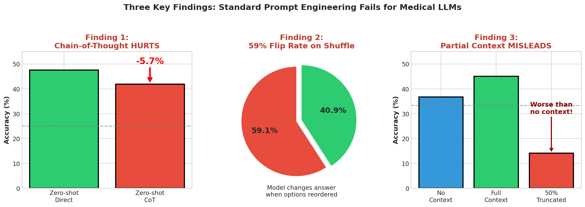

# When Chain-of-Thought Backfires: Evaluating Prompt Sensitivity in Medical Language Models

[](paper/main.pdf)
[](LICENSE)
[](https://www.python.org/downloads/)

This repository contains the code and experiments for our research on prompt sensitivity in medical language models. We evaluate MedGemma (4B and 27B variants) on MedMCQA and PubMedQA, revealing that standard prompt engineering techniques can **harm** rather than help performance on medical question answering.

**Repository:** [https://github.com/thedatasense/MedMCQA-Robustness-Study](https://github.com/thedatasense/MedMCQA-Robustness-Study)

## Key Findings

Our experiments reveal several concerning findings that challenge conventional prompt engineering wisdom:

| Finding | Impact |
|---------|--------|
| **Chain-of-thought hurts** | CoT prompting *decreases* accuracy by 5.7% compared to direct answering |
| **Few-shot backfires** | Few-shot examples decrease accuracy by 11.9% while tripling position bias |
| **Extreme option sensitivity** | Model changes answer 59.1% of the time when options are shuffled |
| **Partial context misleads** | Truncated context (50%) performs *worse* than no context at all |
| **Scale ≠ robustness** | MedGemma-27B underperforms 4B on several conditions |

<p align="center">
  
</p>

## Abstract

Large language models are increasingly deployed in medical settings, yet their sensitivity to prompt formatting remains poorly characterized. We evaluate MedGemma (4B and 27B variants) on MedMCQA (4,183 questions) and PubMedQA (1,000 questions). Our experiments reveal that chain-of-thought prompting decreases accuracy by 5.7% compared to direct answering; few-shot examples degrade performance by 11.9% while increasing position bias from 0.14 to 0.47; shuffling answer options causes the model to change predictions 59.1% of the time with accuracy dropping up to 27.4 percentage points; and truncating context to 50% causes accuracy to plummet below the no-context baseline. These results demonstrate that prompt engineering techniques validated on general-purpose models do not transfer to domain-specific medical LLMs.

## Installation

### Prerequisites

- Python 3.9+
- CUDA-compatible GPU (16GB+ VRAM for 4B model, 80GB for 27B model)
- HuggingFace account with access to [MedGemma models](https://huggingface.co/google/medgemma-4b-it)

### Setup

```bash
# Clone the repository
git clone https://github.com/thedatasense/MedMCQA-Robustness-Study.git
cd MedMCQA-Robustness-Study

# Create virtual environment
python -m venv venv
source venv/bin/activate  # On Windows: venv\Scripts\activate

# Install dependencies
pip install -r requirements.txt

# Login to HuggingFace (required for MedGemma access)
huggingface-cli login
```

### Verify Installation

```bash
python main.py --verify  # Check dependencies
python main.py --test    # Run quick test
```

## Usage

### Running Experiments

```bash
# Run prompt ablation experiment
python main.py -e prompt_ablation -m 4b

# Run option order sensitivity experiment
python main.py -e option_order -m 4b

# Run evidence conditioning experiment (PubMedQA)
python main.py -e evidence_conditioning -m 4b

# Run all experiments with limited data (for testing)
python main.py -e all -m 4b -l 100

# Use 27B model (requires 80GB GPU)
python main.py -e evidence_conditioning -m 27b
```

### Command-Line Options

| Option | Description |
|--------|-------------|
| `-e, --experiment` | Experiment: `prompt_ablation`, `option_order`, `evidence_conditioning`, `all` |
| `-m, --model` | Model: `4b`, `27b` |
| `-l, --limit` | Limit samples (for testing) |
| `-c, --config` | Config file path (default: `configs/base.yaml`) |
| `-o, --output-dir` | Output directory (default: `outputs/results`) |

## Project Structure

```
MedMCQA-Robustness-Study/
├── main.py                          # Main CLI entry point
├── requirements.txt                 # Python dependencies
├── configs/
│   └── base.yaml                    # Configuration
├── src/
│   ├── data/                        # Data loading
│   │   ├── loaders.py               # Dataset loaders
│   │   └── schemas.py               # Data models
│   ├── models/
│   │   ├── base.py                  # Abstract model class
│   │   └── medgemma.py              # MedGemma implementation
│   ├── experiments/
│   │   ├── exp1_prompt_ablation.py  # Prompt strategy comparison
│   │   ├── exp2_option_order.py     # Option shuffle sensitivity
│   │   └── exp3_evidence_conditioning.py  # Context variation
│   ├── prompts/
│   │   ├── templates.py             # Prompt templates
│   │   └── few_shot_examples.py     # Few-shot examples
│   ├── perturbations/
│   │   ├── option_shuffle.py        # Option reordering
│   │   └── context_truncation.py    # Context manipulation
│   ├── evaluation/
│   │   ├── metrics.py               # Accuracy, bias metrics
│   │   └── visualization.py         # Plotting
│   └── utils/
│       ├── caching.py               # Response caching
│       └── checkpointing.py         # Experiment checkpoints
├── scripts/
│   ├── run_experiment.py            # Experiment runner
│   └── run_parallel.py              # Parallel execution
├── notebooks/
│   └── colab_demo.ipynb             # Google Colab demo
├── paper/
│   ├── main.tex                     # Paper source
│   ├── main.pdf                     # Compiled paper
│   ├── references.bib               # Bibliography
│   ├── figures/                     # Generated figures
│   └── generate_figures.py          # Figure generation script
└── outputs/                         # Results (gitignored)
```

## Experiments

### Experiment 1: Prompt Ablation

Compares five prompting strategies on MedMCQA (n=4,183):

| Condition | Accuracy | Position Bias |
|-----------|----------|---------------|
| Zero-shot direct | **47.6%** | 0.137 |
| Zero-shot CoT | 41.9% | 0.275 |
| Few-shot direct | 35.7% | 0.472 |
| Few-shot CoT | 40.8% | 0.413 |
| Answer-only | 43.0% | 0.096 |

### Experiment 2: Option Order Sensitivity

Tests robustness to answer option reordering:

| Perturbation | Accuracy | Flip Rate |
|--------------|----------|-----------|
| Original | 47.6% | — |
| Random shuffle | 29.2% | 58.3% |
| Rotate-1 | 20.2% | 72.9% |
| Rotate-2 | 24.3% | 63.7% |
| Distractor swap | 38.7% | 41.2% |

**Mean flip rate: 59.1%** — the model changes its answer more often than not when options are shuffled.

### Experiment 3: Evidence Conditioning

Tests context sensitivity on PubMedQA (n=1,000):

| Condition | MedGemma-4B | MedGemma-27B |
|-----------|-------------|--------------|
| Question only | 36.7% | 31.0% |
| Full context | 45.0% | 38.2% |
| Truncated 50% | 14.1% | 23.4% |
| Results only | 41.7% | **40.0%** |

Key finding: Truncated context performs **worse** than no context, indicating partial information actively misleads the model.

## Google Colab

Try the experiments in Google Colab:

[](https://colab.research.google.com/github/thedatasense/MedMCQA-Robustness-Study/blob/master/notebooks/colab_demo.ipynb)

**Note:** MedGemma-4B runs on T4 GPU. MedGemma-27B requires A100 80GB with full precision (4-bit quantization produces NaN outputs).

## Recommendations for Practitioners

Based on our findings:

1. **Default to zero-shot direct prompting** until empirical evidence justifies added complexity
2. **Test option order sensitivity** before deployment — consider averaging across orderings
3. **Validate retrieval completeness** for RAG systems — incomplete context can be worse than none
4. **For larger models, prefer selective retrieval** of high-density information (e.g., study conclusions)
5. **Do not assume larger models are more robust** — evaluate on your specific task

## Citation

If you use this code or findings in your research, please cite:

```bibtex
@article{sadanandan2024cot,
  title={When Chain-of-Thought Backfires: Evaluating Prompt Sensitivity in Medical Language Models},
  author={Sadanandan, Binesh},
  journal={arXiv preprint},
  year={2024},
  note={University of New Haven}
}
```

## Paper

The full paper is available at [`paper/main.pdf`](paper/main.pdf).

**Key sections:**
- Introduction and motivation
- Related work on prompt sensitivity and position bias
- Detailed methodology for all three experiments
- Comprehensive results with statistical analysis
- Discussion of failure modes (CoT, position bias, context truncation)
- Recommendations for medical LLM deployment
- Appendix with prompt templates, detailed analyses, and limitations

## License

This project is licensed under the MIT License - see the [LICENSE](LICENSE) file for details.

## Acknowledgments

- [MedGemma](https://huggingface.co/google/medgemma-4b-it) by Google for open model weights
- [MedMCQA](https://huggingface.co/datasets/openlifescienceai/medmcqa) dataset
- [PubMedQA](https://huggingface.co/datasets/qiaojin/PubMedQA) dataset
- Experiments conducted on NVIDIA A100 GPUs

## Contact

**Binesh Sadanandan**
University of New Haven
Email: bsada1@unh.newhaven.edu

---

<p align="center">
  <i>Standard prompt engineering "best practices" do not transfer to medical LLMs.<br>
  Empirical validation on your specific use case is essential.</i>
</p>
